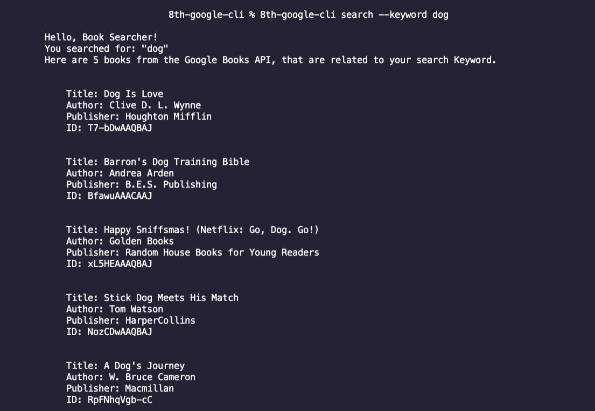

# GOOGLE BOOKS API CLI by Jassmin Herrera
** As of 12/27/21 Edits have been made to this ReadMe to implement feedback.

A command line application that allows you to use the Google Books API to search for books utilizing a keyword from the user, and returning 5 books related to the keyword along with the Author(s), Title, and Publisher. 

# Getting started

These instructions assume that you have already downloaded GIT and Node.JS  and that you have a basic understanding of the Command Line. 

1. Open up your terminal and clone this repository in a location of your choosing.

2. Navigate or cd into the folder 8th-google-cli folder.

3. Install the project dependencies by running `npm i` from within the 8th-google-cli folder. Please refer to the 'Dependencies' section below. 

4. Additionally, in order to make the local npm package (the 8th-google-cli App) to be globally available in our workstation, we run a command, `npm link` . This step allows us to run the command at any location from the command line. 

## ERROR HANDLING AT SET UP
- Errors such as, 'permission denied' please type `sudo` followed by the command. 

### DEPENDENCIES 
Here are the project dependencies used. Please click on the name of the dependency to redirect you to the dependency documentation. 

## [axios]

### [Minimist](https://www.npmjs.com/package/minimist)

- allows us to parse arguments in our command line

## [Jest](https://jestjs.io/docs/getting-started)
 - Javascript Testing 

## [@babel/plugin-proposal-class-properties]

## Google API and KEY 
A .env file was created along with a .gitignore. This was created as a means not to commit the API KEY/URL. The API key and the API URL were placed inside the .env file. It is not necessary for the user to configure an API key. 

# Commands

 ## Version Command

 $ 8th-google-cli version or $ 8th-google-cli -v for the version

 ## Help Command
$ 8th-google-cli help or $ 8th-google-cli -h for the version

## Search Command

$ 8th-google-cli search --keyword `user keyword here`
 - example: $ 8th-google-cli search --keyword cat
 
 
## Screenshot of App

 

